# Component Tester

<div float="left">
<a href="https://www.producthunt.com/posts/usb-component-tester?utm_source=badge-featured&utm_medium=badge&utm_souce=badge-usb-component-tester" target="_blank"></a>
<a href="https://www.tindie.com/stores/akshaybaweja/?ref=offsite_badges&utm_source=sellers_akshaybaweja&utm_medium=badges&utm_campaign=badge_small"></a>
</div>

## Resources
- Firmware Files
    - [USB Component Tester](Firmware/USB-Component-Tester)
- Gerber Files (For PCB Production)
    - [USB Component Tester](Hardware/USB-Component-Tester/GerberFiles.zip)

## Screenshots (with TouchBar Support)
**Welcome Screen** - prompts user to select Serial Port of Component Tester to begin testing
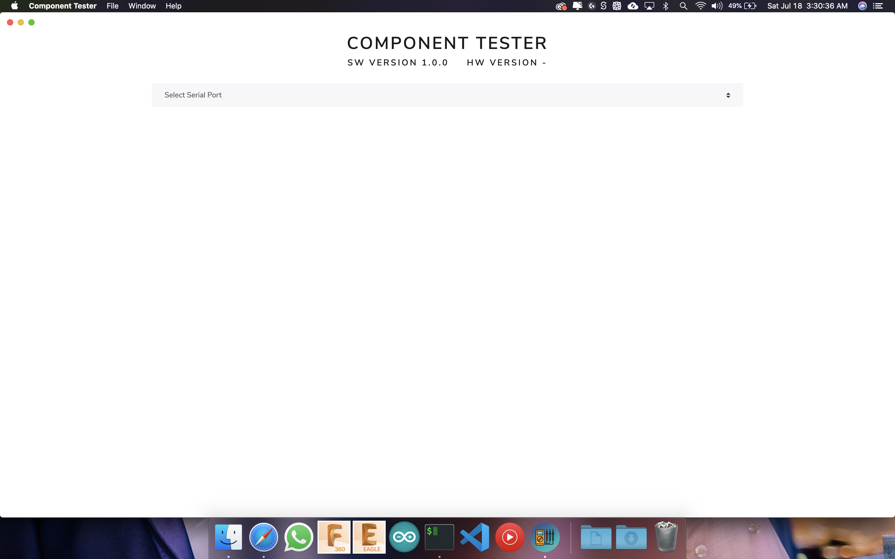


*Selecting Serial Port*
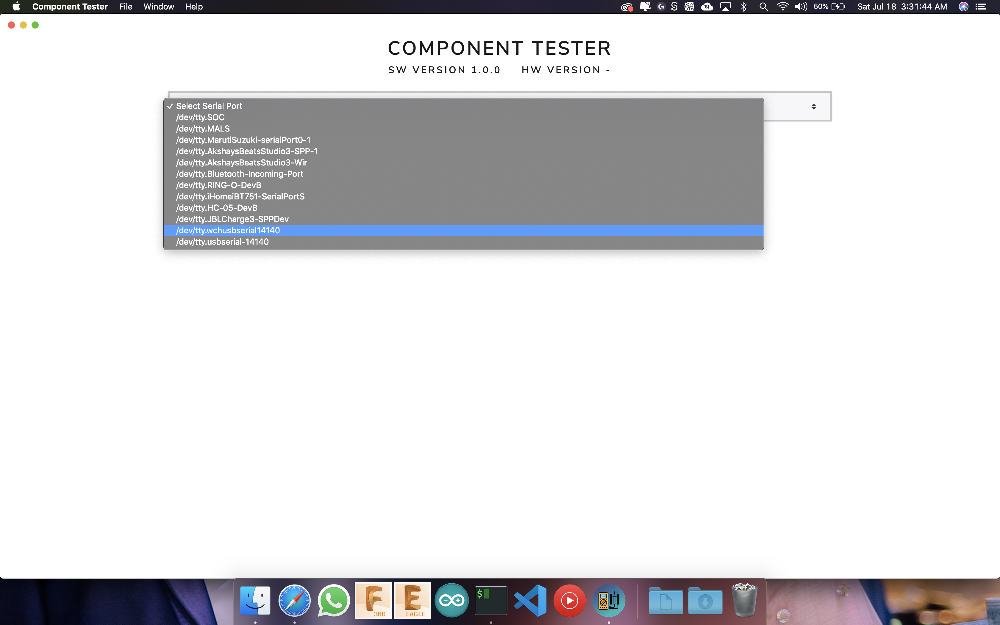

Once the correct serial port is connected it shows up a **TEST** button on screen and as well as on TouchBar *(only mac users)*. Also, shows the hardware version for Component Tester.
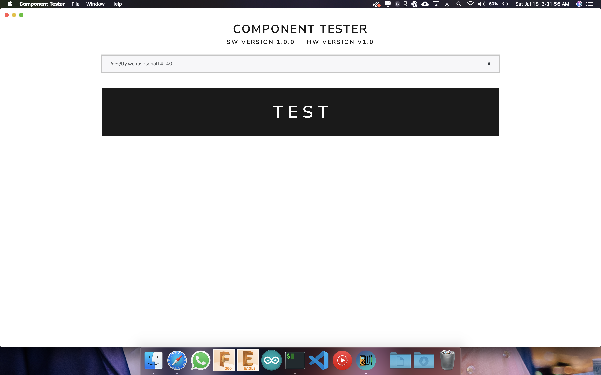
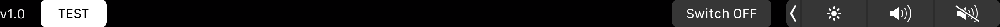

*Testing Screens*
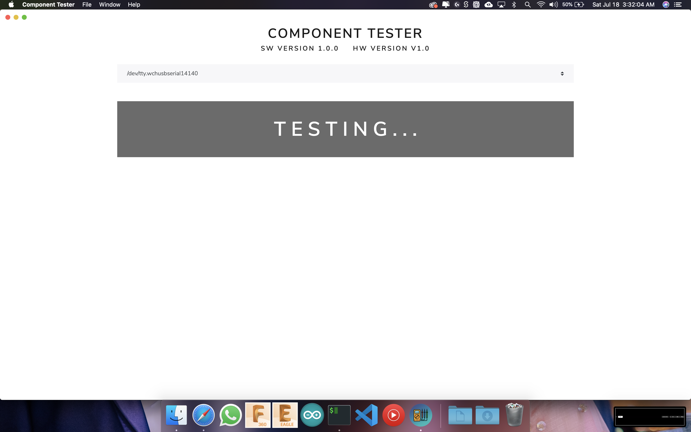
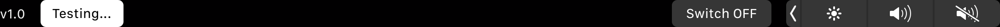


---


### Component Test Results
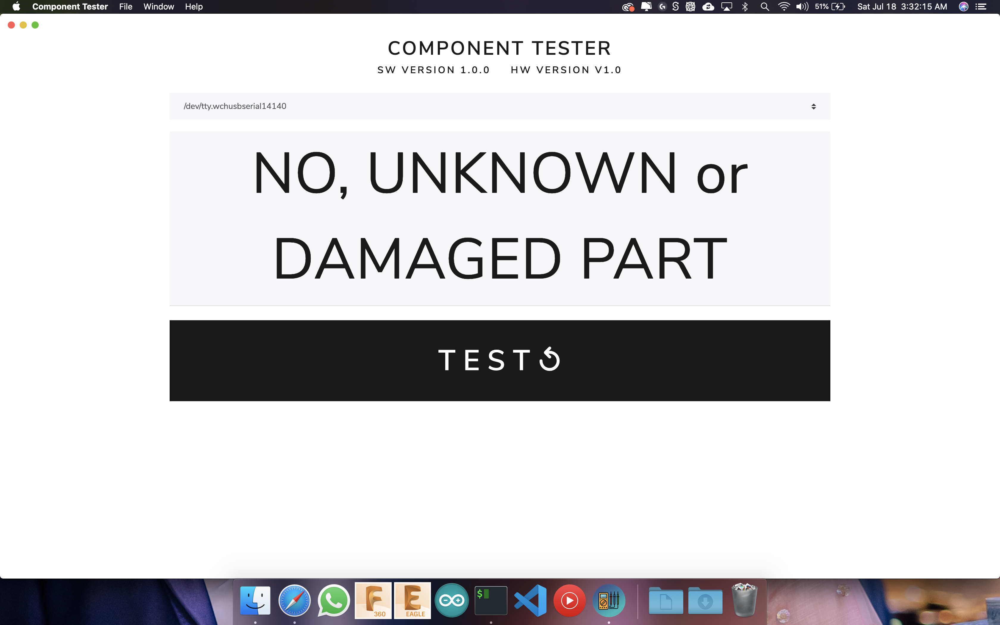
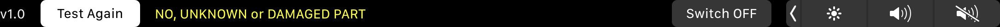
---
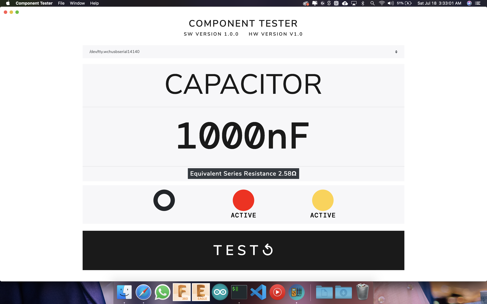
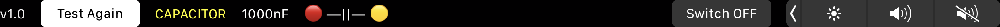
---
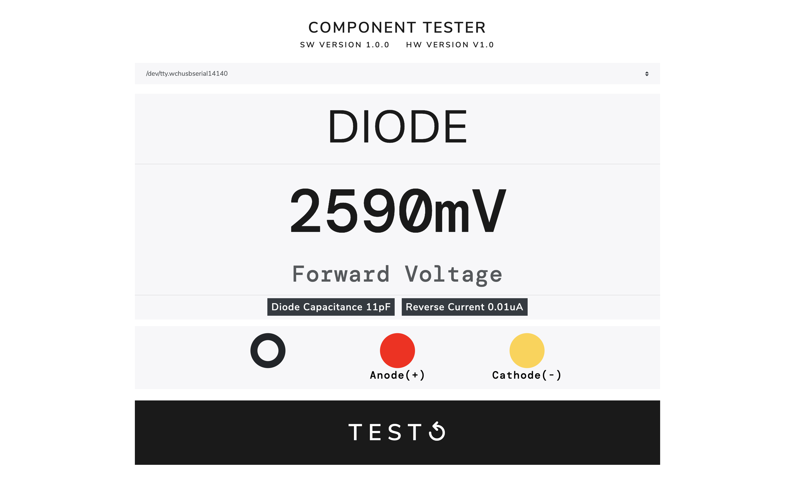
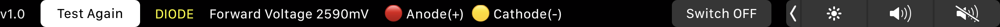
---
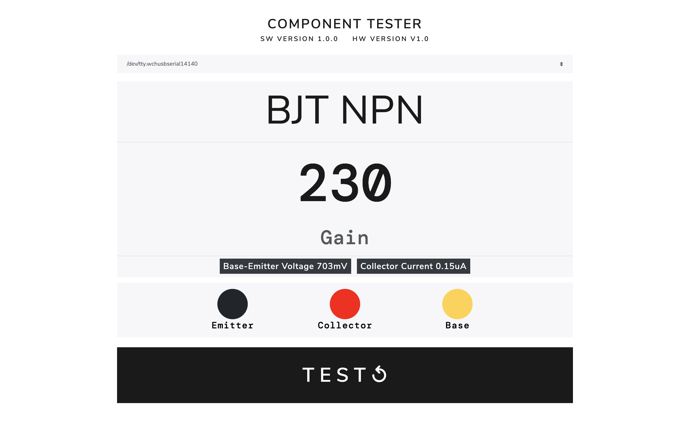
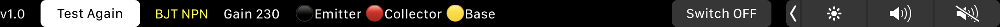


---


## Install

*macOS 10.10+, Linux, and Windows 7+ are supported (64-bit only).*

**macOS**

[**Download**](https://github.com/akshaybaweja/component-tester/releases/latest) the `.dmg` file.

**Linux**

[**Download**](https://github.com/akshaybaweja/component-tester/releases/latest) the `.AppImage` or `.deb` file.

*The AppImage needs to be [made executable](http://discourse.appimage.org/t/how-to-make-an-appimage-executable/80) after download.*

**Windows**

[**Download**](https://github.com/akshaybaweja/component-tester/releases/latest) the `.exe` file.


---


## Dev

Built with [Electron](https://electronjs.org).

### Run

```
$ npm install
$ npm start
```

### Publish

```
$ npm run release
```

After Travis finishes building your app, open the release draft it created and click "Publish".
